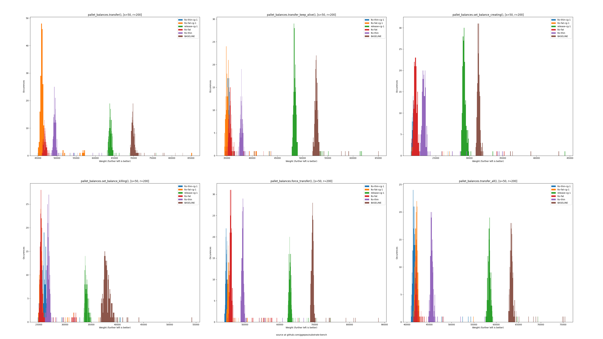

# Compiler flag's impact on benchmarks

How do different compiler flag configurations affect the weights that the
benchmarks calculate?  
Can we get better performance without any code-changes here?  

## Experiment #1 (not on [ref. hardware])

I tested multiple compiler flags for `rustc nightly-2021-12-03`.

Below you can see the outcome of the first experiments for the `balances` pallet.  
This should just show what *can* be done, since it is by no means exhaustive.  

Look out for the `BASELINE` graph which is the current `release` configuration
and compare it with the other ones.  
As you can see; the `BASELINE` is outperformed by every optimisation.  
The only downside is the increased compilation time.  

(The bin size is not uniform in the graph, but you get the idea.)

Legend:  
- baseline: Current `release` configuration as reference.
- lto-fat: [Link time optimization](https://doc.rust-lang.org/rustc/linker-plugin-lto.html) with argument `fat`.
- lto-thin: [Link time optimization](https://doc.rust-lang.org/rustc/linker-plugin-lto.html) with argument `thin`.
- cg-1: [Codegen-units](https://doc.rust-lang.org/rustc/codegen-options/index.html#codegen-units) set to one.
- ~~cpu-target: [target-cpu](https://doc.rust-lang.org/rustc/codegen-options/index.html#target-cpu) set to "native". This does not influence the `wasm=compiled` option.~~ The test for `target-cpu` was faulty and was removed from the graph.

## Experiment #2 (on [ref. hardware])

# Setup

[Bench.md](/scripts/bench.md) describes how to reproduce this.

<!-- LINKS -->
[ref. hardware]: https://docs.substrate.io/v3/concepts/weight/#:~:text=Intel%20Core%20i7%2D7700K%20CPU%20with%2064GB%20of%20RAM%20and%20an%20NVMe%20SSD
