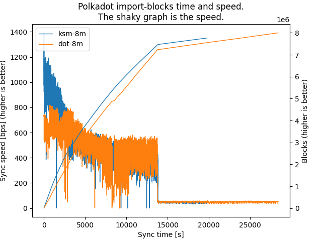

# Observation on Polkadot

The block-import speed of an archive node seems to sharply decrease around Block #7.23M.



This information can be extracted from a [log file](./logs/dot-8m.log) when running `import-blocks` on historical data.

# Explanation

Chat propsed it could be due to the introduction of parachains.  
To (dis)prove this; I will repeat the procedure for Kusama to see if the drop also occurs at the time of parachain introduction.

WIP: Parachain starts ca. https://polkascan.io/polkadot/block/7570000#events and https://polkascan.io/kusama/block/7680000#events

# Setup

The idea is to sync up an Archive node, export the data, purge the data and measure the time it takes to import the chain into an empty node.


1. Sync up an archive node.
2. Export the chain data to a file, eg. `8m.bin`:
```sh
polkadot export-blocks --to 8000000 --binary --db-cache=4096 --pruning archive > ~/8m.bin
```
3. Backup your Polkadot data directory `~/.local/share/polkadot`.
4. Delete the chain data
```sh
polkadot purge-chain -y
```
5. Re-import the data and collect the log.
```sh
polkadot import-blocks --binary --pruning archive --detailed-log-output ~/8m.bin 2>&1 | tee 8m.log
```
6. Use the `plot-log.py` script to create a `import-blocks.png` file.
```sh
pip install matplotlib numpy # Only needed once.
python sync.py 8m.log
```
You can use the `logs` data for testing the script:
```sh
python plot-log.py $(find logs/ -type f)
```
